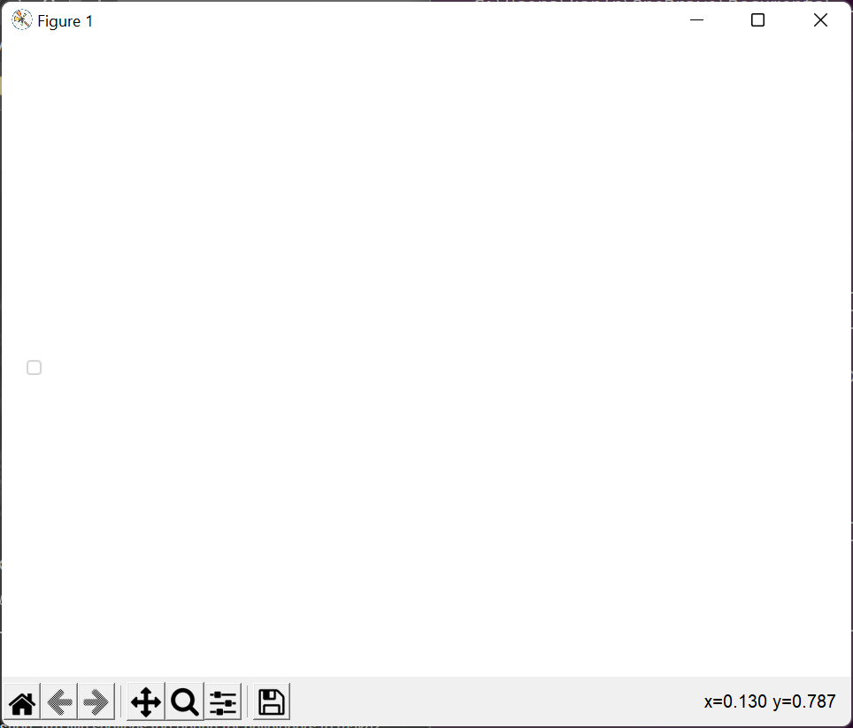

# issue

- [x] 2025-11-22-025253
  - where: PsTool#script#Combinator#Start-Edit, ``edit``
  - howto

    ```powershell
    "C:\note\emp\projek\PythonClub\research\Python-20250122T084419Z-001\Python\Python Curriculum for Students\Book Curriculum\readme.md" | edit
    ```

    or

    ```powershell
    "C:\note\emp\projek\PythonClub\research\Python-20250122T084419Z-001\Python\Python Curriculum for Students\Book Curriculum\readme.md" | dir | edit
    ```

  - actual
    - Editor nvim open to ``emp\projek\PythonClub\research\Python-20250122T084419Z-001\Python\Python\``
  - expected
    - Editor nvim open to ``C:\note\emp\projek\PythonClub\research\Python-20250122T084419Z-001\Python\Python Curriculum for Students\Book Curriculum\readme.md``

- [ ] 2025-07-25-132201
  - where: PsTool#script#Combinator#Select-FlatObject, ``what``
  - description: ArgumentCompleter not working properly
  - howto

    ```powershell
    es -r Minecraft.*\.exe$ | what 2 | dir | what v
    ```

    ```text
    <Tab>
    ```

  - actual

    ```powershell
    es -r Minecraft.*\.exe$ | what 2 | dir | what Attributes
    ```

  - expected

    ```powershell
    es -r Minecraft.*\.exe$ | what 2 | dir | what VersionInfo
    ```

- [ ] 2025-04-27-174931
  - what: Set-Location
  - howto
    - call ``Set-Location`` using a file item as the path argument
    - note: using pipeline works as intended
  - actual

    ```text
    ~  cd C:\Users\karlr\source\repos\demo-PsMarkdownSyntaxTree\PsMarkdownTree\HelloWorld.cs
    Exception: C:\Users\karlr\OneDrive\Documents\WindowsPowerShell\Scripts\PsTool\script\Location.ps1:100
    Line |
     100 |                          $temp = Resolve-Path $_ -ErrorAction Stop
         |                                               ~~
         | Cannot bind argument to parameter 'Path' because it is null.
    ```

  - expected

    ```text
    ~  cd C:\Users\karlr\source\repos\demo-PsMarkdownSyntaxTree\PsMarkdownTree\HelloWorld.cs
    ~\source\repos\demo-PsMarkdownSyntaxTree\PsMarkdownTree  
    ```

- [ ] 2024-01-18-025321
  - what: Query-Object
  - howto

    ```powershell
    Get-GitPendingRepo | what -1, Status
    ```

  - actual

    ```text
    no changes added to commit (use "git add" and/or "git commit -a")
    ```

  - expected

    ```text
    On branch master
    Your branch is up to date with 'origin/master'.

    Changes not staged for commit:
      (use "git add <file>..." to update what will be committed)
      (use "git restore <file>..." to discard changes in working directory)
        modified:   ../issue.md

    no changes added to commit (use "git add" and/or "git commit -a")
    ```

- [ ] 2024-01-17-201116
  - howto

    ```powershell
    dir *.ps1 | sls New-Closure | what -Enumerate
    ```

  - actual

    ```text
    Id Object
    -- ------
     1 C:\Users\karlr\OneDrive\Documents\WindowsPowerShell\Modules\PsQuickform\script\Closure.ps1:71:function New-Closure {
     2 C:\Users\karlr\OneDrive\Documents\WindowsPowerShell\Modules\PsQuickform\script\Layout.ps1:413:            New-Closure `
     3 C:\Users\karlr\OneDrive\Documents\WindowsPowerShell\Modules\PsQuickform\script\Layout.ps1:422:            New-Closure `
     4 C:\Users\karlr\OneDrive\Documents\WindowsPowerShell\Modules\PsQuickform\script\Layout.ps1:437:            New-Closure `
     5 C:\Users\karlr\OneDrive\Documents\WindowsPowerShell\Modules\PsQuickform\script\NumberSlider.ps1:134:        function New-Closure {
     6 C:\Users\karlr\OneDrive\Documents\WindowsPowerShell\Modules\PsQuickform\script\NumberSlider.ps1:145:        $closure = New-Closure `
     7 C:\Users\karlr\OneDrive\Documents\WindowsPowerShell\Modules\PsQuickform\script\NumberSlider.ps1:158:        $closure = New-Closure { $Parameters.Up() } $this
     8 C:\Users\karlr\OneDrive\Documents\WindowsPowerShell\Modules\PsQuickform\script\NumberSlider.ps1:161:        $closure = New-Closure { $Parameters.Down() } $this
     9 C:\Users\karlr\OneDrive\Documents\WindowsPowerShell\Modules\PsQuickform\script\NumberSlider.ps1:166:                New-Closure { $Parameters.Up() } $this
    10 C:\Users\karlr\OneDrive\Documents\WindowsPowerShell\Modules\PsQuickform\script\NumberSlider.ps1:170:                New-Closure { $Parameters.SetToMaximum() } $th…
    11 C:\Users\karlr\OneDrive\Documents\WindowsPowerShell\Modules\PsQuickform\script\NumberSlider.ps1:172:            $closure = New-Closure `
    12 C:\Users\karlr\OneDrive\Documents\WindowsPowerShell\Modules\PsQuickform\script\NumberSlider.ps1:189:                New-Closure { $Parameters.Down() } $this
    13 C:\Users\karlr\OneDrive\Documents\WindowsPowerShell\Modules\PsQuickform\script\NumberSlider.ps1:193:                New-Closure { $Parameters.SetToMinimum() } $th…
    14 C:\Users\karlr\OneDrive\Documents\WindowsPowerShell\Modules\PsQuickform\script\NumberSlider.ps1:195:            $closure = New-Closure `
    15 C:\Users\karlr\OneDrive\Documents\WindowsPowerShell\Modules\PsQuickform\script\NumberSlider.ps1:210:        $closure = New-Closure `
    16 C:\Users\karlr\OneDrive\Documents\WindowsPowerShell\Modules\PsQuickform\script\Qform.ps1:420:                $closure = New-Closure `
    17 C:\Users\karlr\OneDrive\Documents\WindowsPowerShell\Modules\PsQuickform\script\Qform.ps1:489:        $closure = New-Closure `
    18 C:\Users\karlr\OneDrive\Documents\WindowsPowerShell\Modules\PsQuickform\script\Type.ps1:62:            $closure = New-Closure `
    19 C:\Users\karlr\OneDrive\Documents\WindowsPowerShell\Modules\PsQuickform\script\Type.ps1:139:            $closure = New-Closure `
    20 C:\Users\karlr\OneDrive\Documents\WindowsPowerShell\Modules\PsQuickform\script\Type.ps1:441:                            New-Closure `
    ```

  - expected

    ```text
    Id  Object
    --  ------
     1 Closure.ps1:71:function New-Closure {
     2 Layout.ps1:413:            New-Closure `
     3 Layout.ps1:422:            New-Closure `
     4 Layout.ps1:437:            New-Closure `
     5 NumberSlider.ps1:134:        function New-Closure {
     6 NumberSlider.ps1:145:        $closure = New-Closure `
     7 NumberSlider.ps1:158:        $closure = New-Closure { $Parameters.Up() } $this
     8 NumberSlider.ps1:161:        $closure = New-Closure { $Parameters.Down() } $this
     9 NumberSlider.ps1:166:                New-Closure { $Parameters.Up() } $this
    10 NumberSlider.ps1:170:                New-Closure { $Parameters.SetToMaximum() } $this
    11 NumberSlider.ps1:172:            $closure = New-Closure `
    12 NumberSlider.ps1:189:                New-Closure { $Parameters.Down() } $this
    13 NumberSlider.ps1:193:                New-Closure { $Parameters.SetToMinimum() } $this
    14 NumberSlider.ps1:195:            $closure = New-Closure `
    15 NumberSlider.ps1:210:        $closure = New-Closure `
    16 Qform.ps1:420:                $closure = New-Closure `
    17 Qform.ps1:489:        $closure = New-Closure `
    18 Type.ps1:62:            $closure = New-Closure `
    19 Type.ps1:139:            $closure = New-Closure `
    20 Type.ps1:441:                            New-Closure `
    ```

## complete

- [x] 2025-03-21-152537
  - what: Start-Timer
  - howto

    ```powershell
    Start-Timer -Seconds (20 * 60)
    ```

    1. Wait until the timer expires

  - actual

    ```text
    Write-Progress: C:\Users\karlr\OneDrive\Documents\WindowsPowerShell\Scripts\PsTool\script\Timer.ps1:41
    Line |
      41 |                      (100 * (($Total - $Remaining) / $Total) + 1)
         |                      ~~~~~~~~~~~~~~~~~~~~~~~~~~~~~~~~~~~~~~~~~~~~
         | Cannot validate argument on parameter 'PercentComplete'. The 101 argument is greater than the maximum allowed
         | range of 100. Supply an argument that is less than or equal to 100 and then try the command again.
    ```

- [x] 2025-03-08-181048
  - what: Combinator#Get-Progress
  - howto

    ```powershell
    $est = 'Est'; $uan = 'Uan'; $sin = 'Sin'; 1 .. 10 | progress -Begin { $est; $est = 'New Est' } -Process { $uan; Start-Sleep -Milliseconds 200; $uan = "Uan $_" } -End { $sin; $sin = 'New Sin' }; $est; $uan; $sin
    ```

  - actual

    ```text
    Est
    Uan
    Uan 1
    Uan 2
    Uan 3
    Uan 4
    Uan 5
    Uan 6
    Uan 7
    Uan 8
    Uan 9
    Sin
    Est
    Uan
    Sin
    ```

  - expected

    ```text
    Est
    Uan
    Uan 1
    Uan 2
    Uan 3
    Uan 4
    Uan 5
    Uan 6
    Uan 7
    Uan 8
    Uan 9
    Sin
    New Est
    Uan 10
    New Sin
    ```

- [x] 2025-01-31-125001
  - where: ``PsTool: demand: CodeSnippetCapture``
  - howto: ``pwsh -Command "Import-DemandModule CodeSnippetCapture"``
  - actual: success with no error message
  - expectend: error message aprox: ``"Requires -RunAs"``

- [x] 2025-02-12-224254
  - what: Set-Location
  - howto

    ```powershell
    "C:\working\path" | cd
    ```

  - actual

    ```text
    PS ~> "C:\working\path" | cd
    PS ~>
    ```

  - exptected

    ```text
    PS ~> "C:\working\path" | cd
    PS C:\working\path>
    ```

- [x] 2025-02-12-004601
  - what: Set-Location
  - howto

    ```powershell
    Set-Location
    ```

  - actual
    1. change directory to home
    2. echo home directory

    ```text
    PS ~> cd \note
    PS C:\note> cd
    C:\Users\karlr
    PS ~>
    ```

  - expected
    - echo current directory

    ```text
    PS ~> cd \note
    PS C:\note> cd
    C:\note
    PS C:\note>
    ```

- [x] 2025-01-24-022043
  - where: ``demand/Access``
  - howto

    ```powershell
    demand access
    ```

  - actual

    ```text
    New-Alias:
    Line |
     372 |  New-Alias `
         |  ~~~~~~~~~~~
         | The alias is not allowed, because an alias with the name 'focusw' already exists.

    Script Commands                                                                       ModuleName            Location
    ------ --------                                                                       ----------            --------
    Access {Get-OpenWindow, Remove-OpenWindow, Set-ForegroundOpenWindow, Test-OpenWindow} ModuleOnDemand_Access C:\Users\karlr\…
    ```

  - solution
    - add ``-Force`` flag to ``New-Alias``

- [x] 2025-01-13-044140
  - solution: resource files need to have unique identifiers
  - where: ``PsMarkdown/Link``, ``PsTool/demand/OleObject``
  - howto

    ```powershell
    Move-MarkdownItem .\howto_-_2021-05-18_VsVim_ChangeKeybindingSettings.md C:\note\howto\
    ```

  - actual

    ```text
    Move-Item: C:\Users\karlr\OneDrive\Documents\WindowsPowerShell\Scripts\PsMarkdown\script\Link.ps1:670
    Line |
     670 |          Move-Item `
         |          ~~~~~~~~~~~
         | Cannot create a file when that file already exists.
    Move-Item: C:\Users\karlr\OneDrive\Documents\WindowsPowerShell\Scripts\PsMarkdown\script\Link.ps1:670
    Line |
     670 |          Move-Item `
         |          ~~~~~~~~~~~
         | Cannot create a file when that file already exists.
    Move-Item: C:\Users\karlr\OneDrive\Documents\WindowsPowerShell\Scripts\PsMarkdown\script\Link.ps1:670
    Line |
     670 |          Move-Item `
         |          ~~~~~~~~~~~
         | Cannot create a file when that file already exists.
    Move-Item: C:\Users\karlr\OneDrive\Documents\WindowsPowerShell\Scripts\PsMarkdown\script\Link.ps1:670
    Line |
     670 |          Move-Item `
         |          ~~~~~~~~~~~
         | Cannot create a file when that file already exists.
    ```

- [x] 2024-10-16-000505
  - howto
    1. when the working directory has an odd number of duplicates of an item
    2. in powershell

       ```powershell
       dir *.* | Move-ItemDuplicatePair
       ```

  - actual

    ```text
        Directory: C:\temp\2024-10-16_todd

    Mode                 LastWriteTime         Length Name
    ----                 -------------         ------ ----
    d----          10/16/2024 12:03 AM                __dup000
    d----          10/16/2024 12:03 AM                __dup001
    Move-Item:
    Line |
      89 |              Move-Item $_.ReferenceObject $dirName
         |              ~~~~~~~~~~~~~~~~~~~~~~~~~~~~~~~~~~~~~
         | Cannot find path 'C:\temp\2024-10-16_todd\DR7ITUhWkAAVUM3 (1).jpg' because it does not exist.
    d----          10/16/2024 12:03 AM                __dup002
    ```

- [x] 2024-10-16-224609
  - howto

    ```powershell
    Get-DemandScript -InputObject PsSchedule, PsTool -Mode Or
    ```

  - actual

    ```text
    ```

  - expected

    ```text
    C:\Users\karlr\OneDrive\Documents\WindowsPowerShell\Scripts\PsSchedule\demand\MySchedule.ps1
    C:\Users\karlr\OneDrive\Documents\WindowsPowerShell\Scripts\PsSchedule\demand\PplRoutine.ps1
    C:\Users\karlr\OneDrive\Documents\WindowsPowerShell\Scripts\PsSchedule\demand\ScheduleFromTable.ps1
    C:\Users\karlr\OneDrive\Documents\WindowsPowerShell\Scripts\PsSchedule\demand\ScheduleObject.ps1
    C:\Users\karlr\OneDrive\Documents\WindowsPowerShell\Scripts\PsTool\demand\Access.ps1
    C:\Users\karlr\OneDrive\Documents\WindowsPowerShell\Scripts\PsTool\demand\DateFolder.ps1
    C:\Users\karlr\OneDrive\Documents\WindowsPowerShell\Scripts\PsTool\demand\Fsm.ps1
    C:\Users\karlr\OneDrive\Documents\WindowsPowerShell\Scripts\PsTool\demand\ImageConvert.ps1
    C:\Users\karlr\OneDrive\Documents\WindowsPowerShell\Scripts\PsTool\demand\MsExcel.ps1
    C:\Users\karlr\OneDrive\Documents\WindowsPowerShell\Scripts\PsTool\demand\NotepadPlusPlus.ps1
    C:\Users\karlr\OneDrive\Documents\WindowsPowerShell\Scripts\PsTool\demand\ProtectedString.ps1
    C:\Users\karlr\OneDrive\Documents\WindowsPowerShell\Scripts\PsTool\demand\ProxyFunction.ps1
    C:\Users\karlr\OneDrive\Documents\WindowsPowerShell\Scripts\PsTool\demand\Pychart.ps1
    C:\Users\karlr\OneDrive\Documents\WindowsPowerShell\Scripts\PsTool\demand\RemoveDuplicate.ps1
    C:\Users\karlr\OneDrive\Documents\WindowsPowerShell\Scripts\PsTool\demand\Windows.ps1
    ```

- [x] 2024-10-15-010840
  - howto

    ```powershell
    Import-DemandModule DateFolder -PassThru
    ```

  - actual

    ```text
    ```

- [x] 2024-09-18-033326
  - canceled: This function is working as intended. I just need to learn to use it properly.

  - what: Start-Edit
  - howto

    ```powershell
    dir .\duck.txt | edit VsCode
    ```

  - actual

    ```powershell
    Start-Edit: The input object cannot be bound to any parameters for the command either because the command does not take pipeline input or the input and its properties do not match any of the parameters that take pipeline input.
    ```

- [x] 2024-10-16-000842
  - howto

    ```powershell
    Move-ItemDuplicatePair
    ```

  - actual

    ```text
    Get-Content:
    Line |
      32 |                  Get-Content |
         |                  ~~~~~~~~~~~
         | The input object cannot be bound to any parameters for the command either because the command does not take pipeline input or the input and its properties do not match any of the parameters that take pipeline input.
    ```

- [x] 2024-09-18-012356

  - what: Get-DemandScript
  - howto

    ```powershell
    Get-DemandScript -InputObject profile
    ```

  - actual

    ```text
    ```

  - expected

    ```text
    ...\Scripts\PsTool\demand\ImageConvert.ps1
    ```

- [x] 2024-03-24-013846

  - what: demand/ImageConvert#ConvertFrom-ImageWebp
  - howto

    ```powershell
    C:\shortcut\dos\nowebp.bat
    ```

  - actual
    - [Unexpected output](./issue/issue_-_2024-03-24.md)

- [x] 2024-07-03-211153

  - what: DemandScript
  - howto: search for module names using ``Get-DemandMatch``, ``Get-DemandScript``, or ``Import-DemandModule``
  - actual: module names, such as ``DateFolder``, cannot be found

- [x] 2023-12-27-042818
  - todo
    - [ ] unit test
      - ``| Query -1``
      - ``| Query 0``
      - ``| Query 1``
      - ``| Query -Index -1``
      - ``| Query -Index 0``
      - ``| Query -Index 1``
  - where: Filter#Query-Object
  - howto

    ```powershell
    Get-DemandScript -All -Directory "C:\Users\karlr\OneDrive\Documents\WindowsPowerShell\Scripts\PsTool\test\res\DemandFile_DemoTree\" | select FullName | what 0
    ```

  - actual
    - returns entire list
  - expected
    - returns only first element in list

- [x] 2023-12-25-033119
  - where: Demand#Install-DemandModule
  - howto: use ``InputObject`` argument completer in PowerShell 5 terminal
  - actual
    - fails

- [x] 2023-12-20-223459
  - where: Demand#Install-DemandModule
  - actual
    - every instance of ``$PsScriptRoot`` evaluates to ``C:\``
  - expacted
    - every instance of ``$PsScriptRoot`` evaluates to module script location

- [x] 2023-11-21-232252
  - where: ``Out-#Out-NotepadPlusPlus``
  - howto

    ```powershell
    dir \note | Out-NotepadPlusPlus
    ```

  - actual

    ```text
        Directory: C:\note

    Mode                 LastWriteTime         Length Name
    ----                 -------------         ------ ----
    d-----         5/24/2021   4:30 AM                banter

        Directory: C:\note

    Mode                 LastWriteTime         Length Name
    ----                 -------------         ------ ----
    d-----         5/18/2021   8:08 PM                dev

        Directory: C:\note

    Mode                 LastWriteTime         Length Name
    ----                 -------------         ------ ----
    d-----         5/25/2021  12:54 AM                howto
    ```

  - expected

    ```text
        Directory: C:\note


    Mode                 LastWriteTime         Length Name
    ----                 -------------         ------ ----
    d-----         5/24/2021   4:30 AM                banter
    d-----         5/18/2021   8:08 PM                dev
    d-----         5/25/2021  12:54 AM                howto
    ```

- [x] 2022-03-23-230129
  - solution: DEPRECATE
  - where: ``Out-#Out-Notepad``
  - howto

    ```powershell
    'what' | Out-Notepad
    ```

  - system: Win11
  - actual: opens notepad.exe but does not change its window content


- [x] 2022-03-23-225512
  - where: ``Pychart#Show-Pychart``
  - howto

    ```powershell
    Get-FolderSize | Show-Pychart
    ```

  - system: Win11
  - actual: shows blank



---

[← Go Back](../readme.md)

