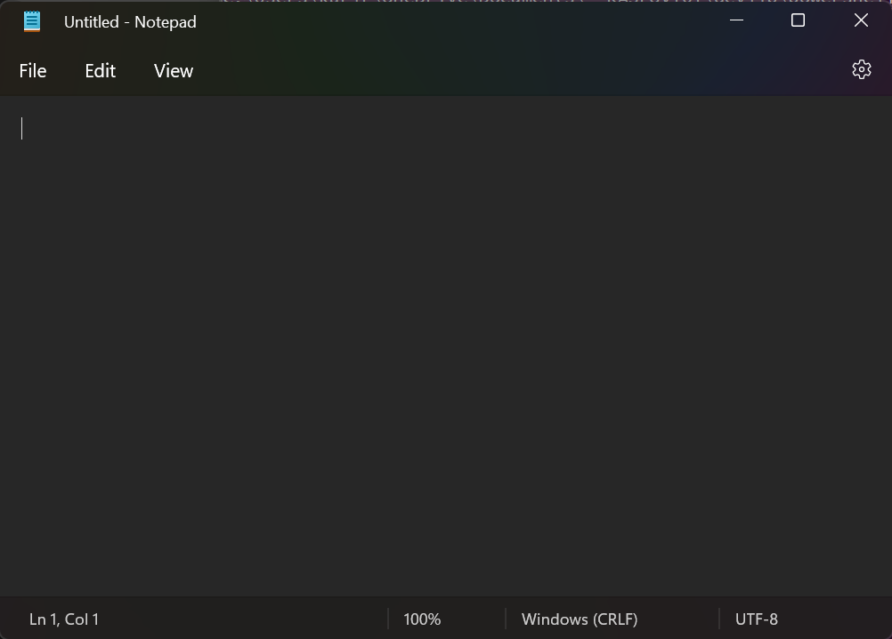
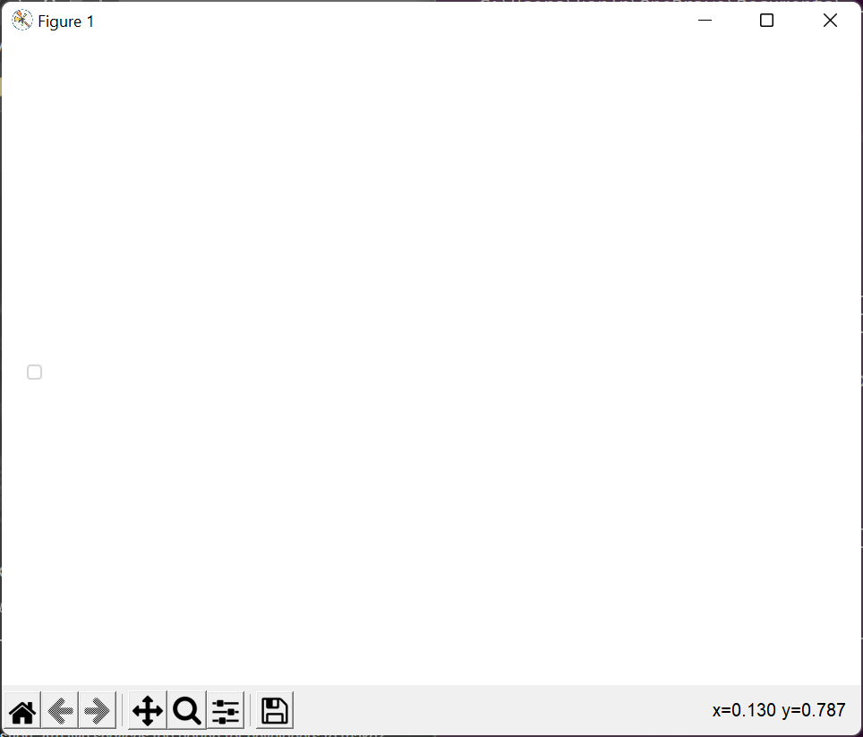

# issue

## complete

- [x] 2022_03_23_230129
  - solution: DEPRECATE
  - where: ``Out-#Out-Notepad``
  - howto

    ```powershell
    'what' | Out-Notepad
    ```

  - system: Win11
  - actual: opens notepad.exe but does not change its window content



- [x] 2022_03_23_225512
  - where: ``Pychart#Show-Pychart``
  - howto

    ```powershell
    Get-FolderSize | Show-Pychart
    ```

  - system: Win11
  - actual: shows blank



---
[← Go Back](../readme.md)
